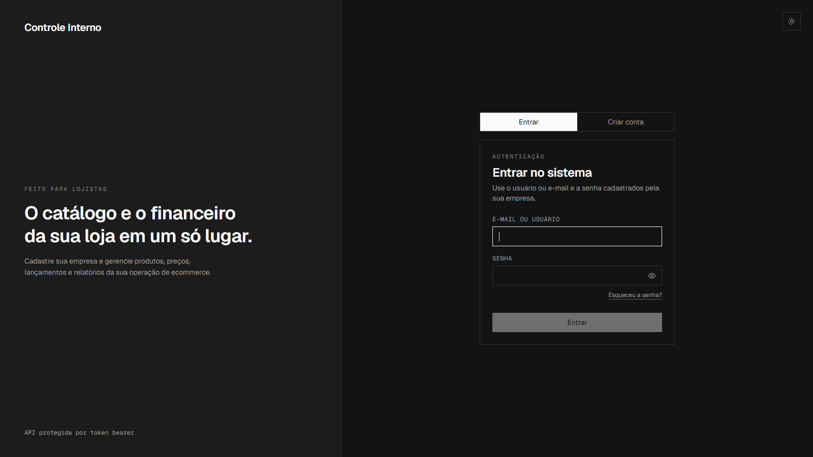
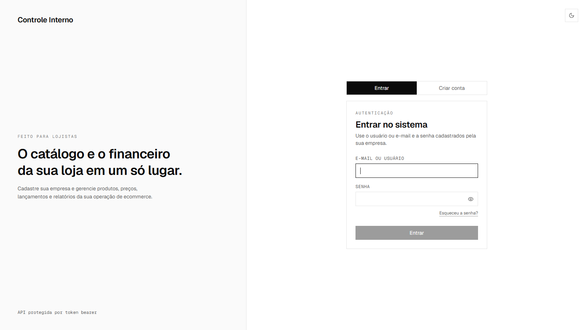

# ecommerce-control

> Painel de controle **multi-tenant** para lojistas Nuvemshop + GestãoClick — catálogo, financeiro e relatórios em PDF em um só lugar. Cada empresa cria sua conta e enxerga apenas os próprios dados.

  

<details>
<summary><strong>🌙 Ver tema dark</strong></summary>



</details>

<details>
<summary><strong>☀️ Ver tema light</strong></summary>



</details>

## O que faz

- **Catálogo** — produtos e variações com SKU/EAN, preços e margens calculadas; edição direto na tabela, estilo planilha.
- **Financeiro** — lançamentos (receitas, custos, despesas), dashboard com KPIs, evolução mensal e composição por categoria.
- **Visão Geral** — funil da loja (visitas → carrinho → checkout → pedidos) preenchido a partir dos relatórios da Nuvemshop.
- **Relatórios em PDF** — catálogo, financeiro e desempenho, com escolha de colunas e filtros.
- **Conta da empresa** — cadastro com CNPJ, login por usuário ou e-mail, recuperação de senha, tema claro/escuro. O painel usa o nome da sua empresa em todas as telas.

## Stack

| Camada | Tecnologias |
|---|---|
| Backend | Python 3.13 · Django 5 · Django Ninja · PostgreSQL 16 · ReportLab |
| Frontend | React 19 · TypeScript · Vite · Tailwind CSS · TanStack Query · AG Grid |
| Infra dev | Docker Compose (tudo sobe com um comando) |

## Como rodar

```bash
git clone https://github.com/davioliveiraes/ecommerce-control.git
cd ecommerce-control
cp .env.example .env
docker compose up -d --build
```

Abra **http://localhost:5173**, clique em **Criar conta** e cadastre sua empresa — o sistema já nasce pronto para uso (categorias financeiras incluídas). A API fica documentada em http://localhost:8000/api/docs.

### Dados de demonstração (opcional)

Depois de criar a conta, popule o painel com dados realistas:

```bash
# Catálogo — nichos: tech ou supermercado
docker compose exec backend python manage.py seed_catalog --empresa "Minha Loja" --nicho tech

# Financeiro — 6 meses de lançamentos + visão geral
docker compose exec backend python manage.py seed_finance --empresa "Minha Loja" --meses 6
```

Os seeds são por empresa e reproduzíveis (`--limpar` refaz do zero).

## Personalização

1. **Nome da loja** — automático: vem do cadastro e é editável em `/empresa`.
2. **Logo/favicon** — `frontend/public/favicon.svg` e `frontend/src/components/Topbar.tsx`.
3. **Categorias financeiras padrão** — `backend/apps/accounts/onboarding.py`.
4. **Catálogo demo de outro nicho** — dict `NICHOS` em `backend/apps/catalog/management/commands/seed_catalog.py`.

## Para desenvolvedores

Arquitetura, decisões técnicas e convenções: [docs/ARQUITETURA.md](docs/ARQUITETURA.md).

```bash
# Testes do backend
docker compose exec backend python manage.py test
```

## Autor

Construído por [Davi Oliveira](https://davioliveira.tech/)
